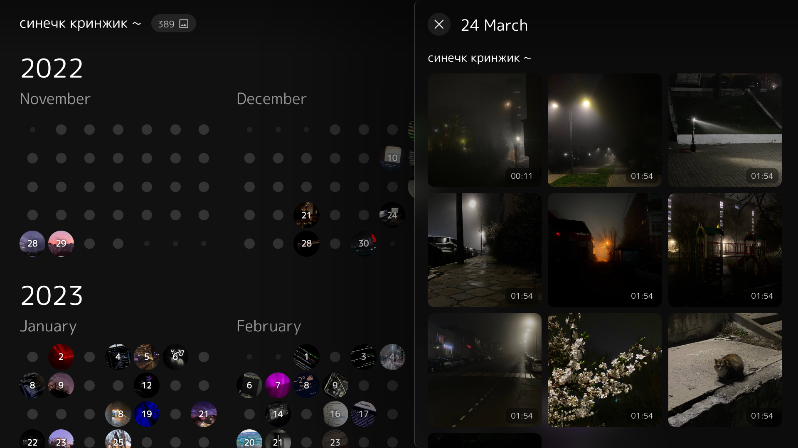
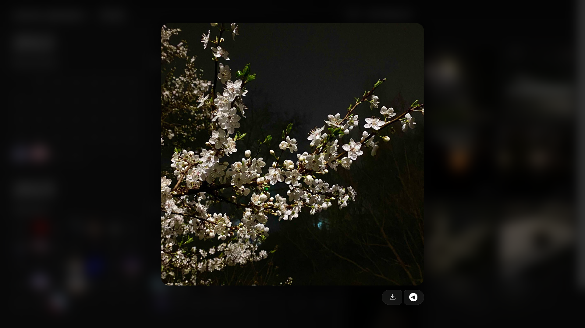

# _GalleryView_
Фотографии из Telegram в виде красивого календаря

- Адаптивный интерфейс под мобильные устройства
- Не требует сложной установки и серверов
- Поддерживает много языков
- Открытый исходный код

### Скриншоты

Нажми, чтобы открыть

 

# Установка
### 1. Экспортируй историю чата
Чтобы экспортировать историю чата:
1. Открой нужный чат в Telegram Desktop
2. Нажми на три точки сверху справа
3. "Экспортировать историю чата"
4. Выбери "Фотографии"
5. Используй формат JSON, **не HTML**
6. Открой экспортированный чат в проводнике

Протестировано на:

- Личных чатах
- Приватных и публичных каналах
- Каналах с указанием авторства поста

### 2. Добавление проекта
1. Скачай архив [`здесь`](https://github.com/ktnk-dev/GalleryView/archive/refs/heads/main.zip) или по кнопке "Code" > "Download zip"
2. Открой архив, перенеси контент папки `GalleryView-main` в папку с экспортированным чатом

### 3. Конвертируй данные
Чтобы их сконвертировать, можно:

- Запустив `convert.bat` (процесс долгий, консоль закроется сама)
- Запустив `convert.py` если установлен Python 3 (моментально)
- Самостоятельно добавить `const messages = ` в первую строку файла `result.json`, перед символом `{` и переименовать его в `result.js`

### Проект установлен
Запусти `index.html`, откроется браузер с календарем, доступно оффлайн, интернет нужен только для шрифтов
